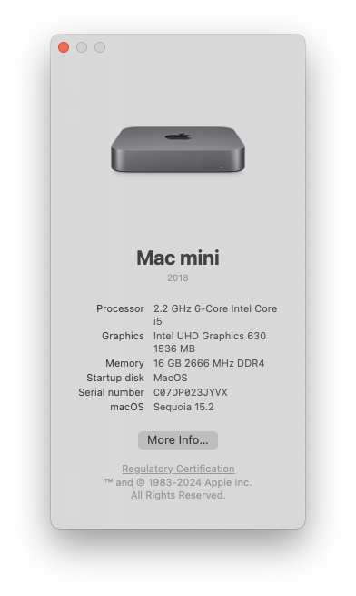
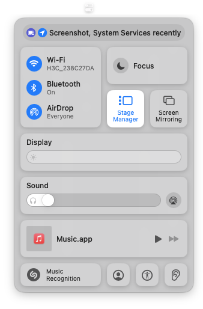

# Lenovo-M720Q-OpenCore-EFI



This repository provides the EFI configuration for **[Lenovo ThinkCentre M720Q Tiny](https://www.lenovo.com/us/en/p/desktops/thinkcentre/m-series-tiny/thinkcentre-m720q/11tc1mtm72q)** with **[OpenCore](https://github.com/acidanthera/OpenCorePkg)** bootloader ([v1.0.3](https://github.com/acidanthera/OpenCorePkg/releases/tag/1.0.3)).

Most of the features of MacOS are working fine, including:

- [x] DP/HDMI video output (VGA not tested)
- [x] Audio output (both internal speaker and headphone jack)
- [x] USB ports
- [x] Sleep, Wake, Hibernate
- [x] Ethernet, Wi-Fi, Bluetooth (works just as well on Sonoma or Sequoia)
- [x] AirDrop, Handoff, iMessage, FaceTime ...



## Hardware Configuration

|  Component   |                                                                                  Model                                                                                   |
| :----------: | :----------------------------------------------------------------------------------------------------------------------------------------------------------------------: |
| Motherboard  |                                                                                   B360                                                                                   |
| BIOS Version | [M1UKT77A/1.0.0.119](https://support.lenovo.com/us/en/downloads/ds503907-flash-bios-update-thinkcentre-m720t-m720s-m720q-m920t-m920s-m920q-m920x-thinkstation-p330-tiny) |
|     CPU      |                                                                              Intel i5-9500T                                                                              |
|     iGPU     |                                                                          Intel UHD Graphics 630                                                                          |
|    Audio     |                                                                              Realtek ALC233                                                                              |
|   Ethernet   |                                                                               Intel I219-V                                                                               |
|   Wireless   |                                                                                BCM94360Z4                                                                                |

## Folder Structure

```plaintext
Lenovo-M720Q-OpenCore-EFI
├── EFI_No_Broadcom_Fix
│   ├── BOOT
│   └── OC
│       ├── ...
│       ├── config_DEBUG.plist
│       ├── config_DEBUG_CFG_Unlocked.plist
│       └── config_RELEASE.plist
└── EFI_With_Broadcom_Fix
    └── ...
```

Since Apple has dropped support for the Broadcom Wi-Fi chipsets used in pre-2017 Macs, additional kexts and configurations are required to make them work properly on Sonoma and newer systems.

For this reason, two versions of EFI are provided:

- [`EFI_No_Broadcom_Fix`](./EFI_No_Broadcom_Fix) for Ventura and older systems or those not using Broadcom cards
- [`EFI_With_Broadcom_Fix`](./EFI_With_Broadcom_Fix) for **Sonoma and newer systems with Broadcom cards**

And since the official BIOS does not provide an option for the **CFG Lock** switch, you will need to unlock it manually in this case. Therefore, I have provided multiple versions of the `config.plist` file in each EFI folder:

- `config_DEBUG.plist`: To be used when CFG is not unlocked.
- `config_DEBUG_CFG_Unlocked.plist`: To be used after CFG has been unlocked.
- `config_RELEASE.plist`: Debug information during the boot process is disabled.

Choose the appropriate configuration file and **rename it to `config.plist`**.

*:warning: Remember to replace the `PlatformInfo` section with your own values in the `config.plist` file.*