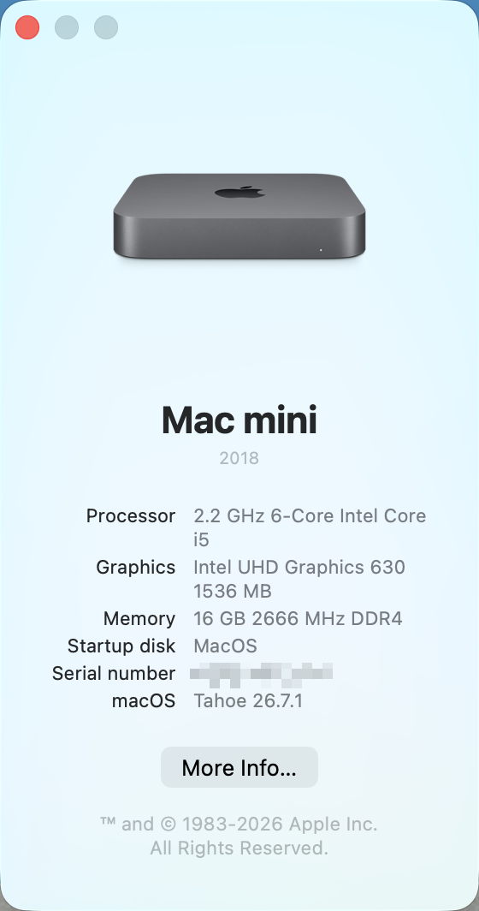
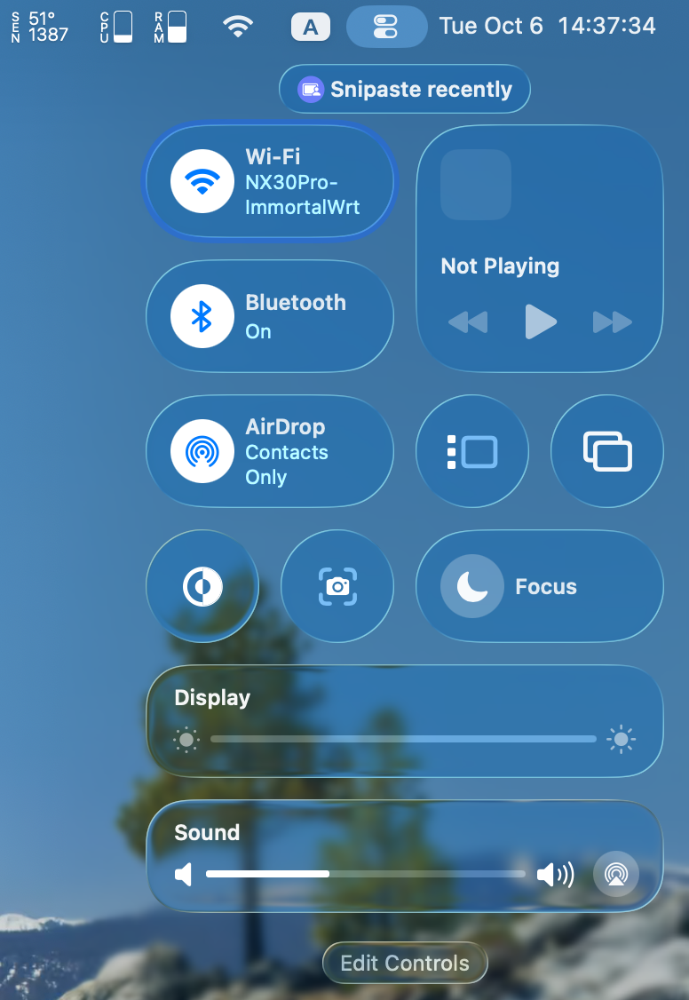

# Lenovo-M720Q-OpenCore-EFI

[English](./README.md) | 简体中文

> [!NOTE]
> 在使用此 EFI 前，请完整阅读并理解本文档，以避免对系统甚至硬件造成不可预知的损害。



本仓库为 **[联想 ThinkCentre M720Q Tiny](https://www.lenovo.com/us/en/p/desktops/thinkcentre/m-series-tiny/thinkcentre-m720q/11tc1mtm72q)** 提供基于 **[OpenCore](https://github.com/acidanthera/OpenCorePkg)** 引导加载程序 ([v1.0.8](https://github.com/acidanthera/OpenCorePkg/releases/tag/1.0.8)) 的 EFI 配置。

MacOS 的大部分功能运行良好且稳定，包括：

- [x] DP/HDMI 视频输出 (VGA 未测试)
- [x] 音频输出 (内置扬声器和耳机插孔均可用)
- [x] USB 端口
- [x] 睡眠、唤醒、休眠
- [x] 有线网络、Wi-Fi、蓝牙
- [x] 隔空投送、接力、iMessage、FaceTime 等




## 硬件配置

|   组件    |                                                                                   型号                                                                                   |
| :-------: | :----------------------------------------------------------------------------------------------------------------------------------------------------------------------: |
|   主板    |                                                                                   B360                                                                                   |
| BIOS 版本 | [M1UKT79A/1.0.0.121](https://support.lenovo.com/us/en/downloads/ds503907-flash-bios-update-thinkcentre-m720t-m720s-m720q-m920t-m920s-m920q-m920x-thinkstation-p330-tiny) |
|    CPU    |                                                                              Intel i5-9500T                                                                              |
|   核显    |                                                                          Intel UHD Graphics 630                                                                          |
|   声卡    |                                                                              Realtek ALC235                                                                              |
| 有线网卡  |                                                                               Intel I219-V                                                                               |
| 无线网卡  |                                                                                BCM94360Z4                                                                                |

## 目录结构

```plaintext
Lenovo-M720Q-OpenCore-EFI
├── Sequoia
│   ├── EFI_No_Broadcom_Fix
│   │   ├── BOOT
│   │   └── OC
│   │       ├── ...
│   │       ├── config_DEBUG.plist
│   │       ├── config_DEBUG_CFG_Unlocked.plist
│   │       └── config_RELEASE.plist
│   └── EFI_With_Broadcom_Fix
│       └── ...
└── Tahoe
    ├── EFI_No_Broadcom_Fix
    │   └── ...
    └── EFI_With_Broadcom_Fix
        └── ...
```

### EFI 版本说明

本仓库按 macOS 版本提供了两组 EFI：

- [`Sequoia`](./Sequoia) 适用于 macOS Sequoia（及之前）
- [`Tahoe`](./Tahoe) 适用于 macOS Tahoe

由于苹果已停止对 Broadcom Wi-Fi 芯片组的支持（在 2017 年之前 Mac 中使用），需要在 Sonoma 及后续的系统上使用额外的 kext 和配置才能使它们正常工作。

因此，每组 EFI 中均包含两个版本：

- `EFI_No_Broadcom_Fix` 适用于不使用 Broadcom 网卡的情况
- `EFI_With_Broadcom_Fix` 适用于 **使用 Broadcom 网卡的情况**

### config.plist 版本说明

并且由于官方 BIOS 未提供 CFG Lock 的切换选项，需要手动去解锁（[参考](https://github.com/psvajaz/Lenovo-ThinkCentre-M720Q-i3-9100-Hackintosh/blob/main/Tools/README.md)）。因此，我在每个 EFI 文件夹中提供了多个版本的 config.plist 文件：

- `config_DEBUG.plist`：在未解锁 CFG 时使用。
- `config_DEBUG_CFG_Unlocked.plist`：在解锁 CFG 后使用。
- `config_RELEASE.plist`：禁用启动过程中的调试信息。

请选择合适的配置文件并**重命名为 `config.plist`**。

> [!WARNING]
> 请注意：请务必在 `config.plist` 文件中将 `PlatformInfo` 部分的 `[REPLACE]` 替换为您自己的值。
